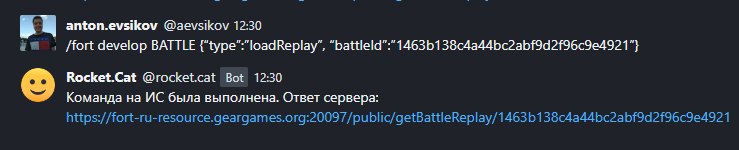
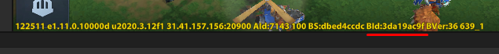
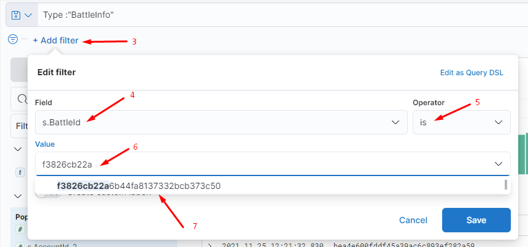
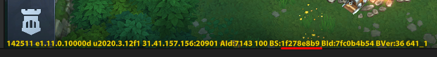
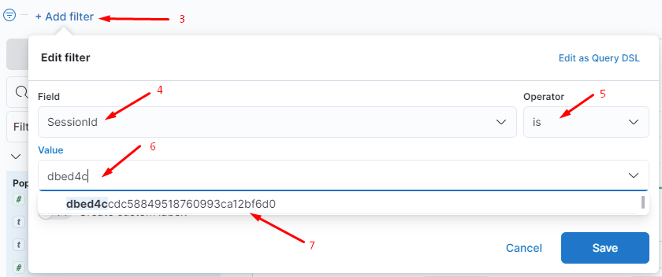

# BATTLE

<details>
<summary>Загрузка сохраненного боя</summary>

**Назначение команды:** Команда позволяет загрузить бой с серверов игры.

`BattleId` боя можно узнать несколькими способами:

1. С помощью [кибаны](https://yt.gearwap.ru/articles/FORT-A-936/Poluchenie-ID-boya-igroka#%D1%81%D0%BF%D0%BE%D1%81%D0%BE%D0%B1-%E2%84%961) (Способ №1)
2. С помощью [команды на Получение ID боя игрока](https://yt.gearwap.ru/articles/FORT-A-936/Poluchenie-ID-boya-igroka#%D1%81%D0%BF%D0%BE%D1%81%D0%BE%D0%B1-%E2%84%962) (Способ №2, 3). Данные способы работают только, когда игрок в бою.
3. `BattleId` можно указывать от 6 символов. Если бой не нашли это значит либо боя нет, либо нашлось два и более.

Во 2-м случае необходимо вводить `BattleId` более информативней

Пример команды для получения реплея:
```
/fort develop BATTLE {"type":"loadReplay", "battleId":"b864dc47a52b4ffa9149745d634a0902f"}
```

Вместо `develop` можно поставить `balance, performance`.

**Результатом** запроса будет ссылка на реплей (запись боя):



**Для выгрузки реплея** необходимо нажать на полученную ссылку и скачать **lgc** файл в нужную директорию

</details>
<details>
<summary>Получение ID боя игрока</summary>

**Назначение:** Способы получения ID боя

<details>
<summary>Способ №1</summary>

С помощью кибаны:

1. В бою есть строка BId: ... (подчеркнута красным на скриншоте), записываем/запоминаем/делаем скриншот.



2. [Переходим в кибану](https://fort-elkdev.gearwap.ru/goto/1c9ad483abccfc4752a742abf90b7fc0?security_tenant=global).

3. Нажимаем кнопку `Add filter` -> появляется окно как рисунке.
4. В поле `Field` вводим `s.BattleId`.
5. В поле `Operator` вводим `is`.
6. В поле `Value` вводим набор символов, которые записали из боя -> кибана сама найдет оставшиеся символы `BattleId`,
   которые нам требуются.
7. Жмем на появившиеся символы - это полный `BattleId`, который требуется для команды.



</details>
<details>
<summary>Способ №2</summary>

C помощью `AccountId` и команды на порт:
Важно! Команда работает только, когда игрок в бою.

1. Смотрим `AccountId` профиля, который участвует сейчас в бою, его можно увидеть внизу
2. Вводим команду в личный чат
```
/fort develop BATTLE {"type": "playerBattleByID", "accountID":7143}
```
3. Ответным сообщением получаем требуемый `BattleID`
</details>
<details>
<summary>Способ №3</summary>

C помощью `SessionId` и команды на порт:
Важно! Команда работает только, когда игрок в бою.

1. В бою есть строка BS: ... (подчеркнута красным на скриншоте), записываем/запоминаем/делаем скриншот.



2. Переходим в кибану
3. Нажимаем кнопку `Add filter` -> появляется окно как рисунке.
4. В поле `Field` вводим `SessionId`.
5. В поле `Operator` вводим is.
6. В поле `Value` вводим набор символов, которые записали из боя -> кибана сама найдет оставшиеся символы `SessionId`,
   которые нам требуются.
7. Жмем на появившиеся символы - это полный `SessionId`, который требуется для команды.


8. Вводим команду
```
/fort develop BATTLE {"type":"playerBattleBySession","sessionID":"1f278e8b99af43cba19691c48e2232fe"}
```
9. Ответным сообщением получаем требуемый `BattleID`

**Результатом** запроса будет требуемый `BattleID`.
</details>
</details>

