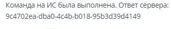

# BROADCAST

**Назначение команд:** Команды для управления почтовыми рассылками

<details>
<summary>Добавление нового широковещательного сообщения</summary>

**Назначение команды:** Позволяет добавить новое сообщение в рассылку c указанной категорией. Возвращает ID созданного сообщения.

Пример для общей рассылки:
```
/fort develop BROADCAST {"type":  "addLetter", "category": "ALL", "message": {...}}
```
Пример для рассылки по лигам:
```
/fort develop BROADCAST {"type": "addLetter", "category": "LEAGUE", "broadcastInfo": {"league": 1, "faction": "LIGHT", "leagueType": "MIN"}, "message": {...}}

league - Порядковый номер лиги (1..N)
faction - Фракция игрока (LIGHT/DARK)
leagueType - Модификатор условия (MIN/MAX)

Одновременно можно задать фракцию и лигу, либо модификатор и лигу. Задать все 3 параметра нельзя. Это лишено смысла. 
Помимо этого для категории LEAGUE должно быть заполнено минимум 2 параметра.
```

**Результатом** выполнения команды будет добавление нового сообщения в рассылку c указанной категорией.

</details>
<details>
<summary>Просмотр сообщений рассылки</summary>

**Назначение команды:** Позволяет получить все сообщения из указанной рассылки

Пример команды:
```
/fort develop BROADCAST {"type": "getList", "category": "ALL"}
```

**Результатом** выполнения команды будет получение всех сообщений из указанной рассылки.

</details>
<details>
<summary>Изменение широковещательного сообщения</summary>

**Назначение команды:** Позволяет заменить созданное широковещательное сообщение новым, не изменяя ID сообщения.

Пример команды:
```
/fort develop BROADCAST {"type":"updateLetter","category":"ALL","messageId":"id","message":{"category": "COMMON", "caption": "string", "description": "string", "spriteName": "string", "buttonsInfo": [ { "url": "string", "labelName": "string", "spriteName": "string" }], "products": [ { "type": "CURRENCY", "typeId": 3, "amount": 10 } ]}}
```
```
"message": {
"category": "COMMON", //обязательное поле. Варианты: COMMON, SERVICE, IMPORTANT
"caption": "string", //обязательное поле
"description": "string", //обязательное поле
"spriteName": "string", //обязательное поле
"buttonsInfo": [ { "url": "string", "labelName": "string", "spriteName": "string" } ],
"products": [ { "type": "CURRENCY", "typeId": 3, "amount": 10 } ] //Варианты type: CURRENCY, CARD, EQUIPMENT, SCROLL, CHEST. Для каждого type, есть еще и typeId. К примеру для CURRENCY: ID_SOFT=2, ID_HARD=3, ID_BATTLE_PASS_POINT=5
}
```

**Результатом** выполнения команды будет замена ранее созданного широковещательного сообщения новым, не изменяя
ID старого сообщения.

</details>
<details>
<summary>Удаление широковещательного сообщения</summary>

**Назначение команды:** Позволяет удалить созданное широковещательное сообщение по ID.

Пример команды:
```
/fort develop BROADCAST {"type": "removeLetter", "letterId": "9c4702ea-dba0-4c4b-b018-95b3d39d4149"}
```
Способы получения `letterId` - идентификатора письма:

1. Приходит во время выполнения добавления нового широковещательного сообщения командой `BROADCAST` с `type = addLeter`.



2. С помощью команды для просмотра сообщений рассылки. Пример:

`/fort develop BROADCAST {"type": "getList", "category": "ALL"}`

**Результатом** выполнения команды будет удаление ранее созданного широковещательного сообщения, вне зависимости от того,
было ли открыто письмо пользователем. Награда, полученная пользователем, во время удаления письма изъята не будет.
</details>
