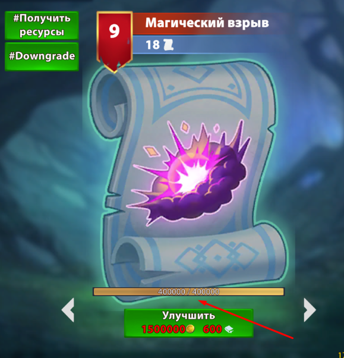

# DEBUG

<details>
<summary>Прогрес мета туториала</summary>

**Назначение команд:** предназначены для управления прогрессом игрока в мета туториале

* Установка прогресса по мета тутора

Пример команды:
```
/fort develop DEBUG {"type":"setProfileTutorialData", "accountId": 3289, "tutorialData": "[[1,1,0],[2,4,-1],[3,2,2],[4,1,1]]"}
```

Формат строки для `tutorialData` : `[[chainId,chainVersion,taskId],[chainId,chainVersion,taskId],...]`

* Получение информации о прогрессе по мета тутору

Пример команды:
```
/fort develop DEBUG {"type":"getProfileTutorialData", "accountId": 3289}
```
</details>
<details>
<summary>Накрутка визуального рейтинга</summary>

**Назначение команд:** Позволяет установить значение рейтингов и лиг для профиля по ID аккаунта игрока.

* Накрутка визуального рейтинга по дивизиону

Пример команды:
```
/fort develop DEBUG {"type":"setVisualRatingByDivision", "accountID": 3289, "division":3}
```

`division` - значение дивизиона (id). Игрок вступит в дивизион по указанный в команде.
[Список дивизионов](https://docs.google.com/spreadsheets/d/1doTNlgvJ00PMs5p5mrQxBEPuylVA7ZXbSfeNk2WpI14/edit#gid=111504635).

Вместо `develop` можно поставить `alpha, beta, feature`

**Важно:** Увеличивается только визуальный рейтинг, матчинг рейтинг остается без изменений!

**Результатом** выполнения запроса будет увеличение визуального рейтинга.

* Накрутка визуального рейтинга по рейтингу

Пример команды:

```
/fort develop DEBUG {"type":"setVisualRatingByRating", "accountID": 3289, "faction":"LIGHT", "rating":3}
```

`faction` - фракция, в которой необходимо установить рейтинг; варианты faction: NONE, LIGHT, DARK.

`rating` - визуальный рейтинг, который необходимо установить аккаунту.

Вместо `develop` можно поставить `alpha, beta, feature`

**Важно:** Увеличивается только визуальный рейтинг, матчинг рейтинг остается без изменений!

**Результатом** выполнения запроса будет увеличение визуального рейтинга.
</details>
<details>
<summary>Накрутка опыта свитков</summary>


**Назначение команд:** Позволяет установить значение опыта для конкретного свитка (для работоспособности необходимо иметь хотя бы 1 свиток, которому накручивается опыт).

Пример команды:
```
/fort develop DEBUG {"type": "setScrollXp", "accountID": 3076, "scrollId": 1, "scrollXp": 150}
```

`accountID` - id аккаунта, на который выдаются свитки;

`scrollId` - id свитка из списка. Свитки;

`scrollXp` - кол-во опыта для прокачки свитка.

Вместо `develop` можно поставить `alpha, beta, feature`.

**Результатом** выполнения запроса будет заполнение шкалы опыта для прокачки свитка.



</details>
<details>
<summary>Открытие юнитов\зданий\героев, экипировки и свитков</summary>

* **Назначение команды:** Позволяет открыть все сущности и экипировку. Экипировка выдается
  в интервале `[minEquipmentLVL; maxEquipmentLVL]`.

Пример команды:
```
/fort develop DEBUG {"type": "openAllEntityAndSetEquipments", "accountID": 9,"openEntity": true,"countScroll": 20,"minEquipmentLVL": 1,"maxEquipmentLVL": 10}
```

`openEntity` - флаг: открывать сущности или нет;

`countScroll` - кол-во свитков;

`minEquipmentLVL` - минимальный уровень экипировки (минимум 1);

`maxEquipmentLVL` - максимальный уровень экипировки (максимум 10);

Вместо `develop` можно поставить `alpha, beta, feature`.

**Результатом** выполнения запроса будет открытие всех сущностей и экипировки, заданных уровней.

* **Назначение команды:** Позволяет открыть все сущности (без наката экипировки)
  Пример команды:
```
/fort develop DEBUG {“type”: “openAllEntity”, “accountID”: 1, “openOnlyByLeague”: false }
```
`accountId` - id аккаунта, у которого нужно открыть все сущности;

`openOnlyByLeague` - параметр открытия по текущей лиге, или нет.

**Результатом** выполнения запроса будет открытие всех сущностей и накатка максимального рейтинга
(Если поставить openOnlyByLeague - true, то откроются только доступные по текущей лиги сущности)

* **Назначение команды:** Выдается экипировка конкретного уровня на все открытые сущности

Пример команды:
```
/fort develop DEBUG {"type": "setEquipments", "accountID": 1, "equipmentLVL": 3}
```

`accountId` - id аккаунта, которому необходимо выдать экипировку;

`equipmentLVL` - уровень экипировки (минимум 1, максимум 10);

**Результатом** выполнения запроса будет выдача всей экипировки указанного уровня для всех открытых сущностей

* **Назначение команды:** Выдается указанное количество всех свитков

Пример команды:
```
/fort develop DEBUG {"type": "setScrolls", "accountID": 1, "countScroll": 3}
```

`accountId` - id аккаунта, которому нужно выдать свитки;

`countScroll` - количество свитков;

**Результатом** выполнения запроса будет выдача всех свитков в количестве указанном в команде

* **Назначение команды:** Удаляется вся экипировка у игрока (в том числе и надетая)

Пример команды:
```
/fort develop DEBUG {"type": "deleteEquipments", "accountID": 1}
```

`accountId` - id аккаунта, которому нужно удалить всю экипировку;

**Результатом** выполнения запроса будет удаление всей экипировки

</details>
<details>
<summary>Апгрейд сущностей</summary>

**Назначение команд:** Апгрейд одной/всех сущностей.

* Апгрейд **одной** сущности (юнит, здание, свиток).

Пример команды:
```
/fort develop DEBUG {"type": "upgradeUnitBuildingScroll", "accountID": 9, "entityId": 9, "upgradeTypeEnum":"UNIT", "maxUpgradeLVL": 10}
```
варианты `upgradeTypeEnum: NONE, BUILDING, SCROLL`.

`entityId` - Id сущности. Юниты; Здания; Свитки;

`upgradeTypeEnum` - тип сущности;

`maxUpgradeLVL` - максимальный уровень апгрейда (минимум 10, максимум 100), первая цифра означает мажорный уровень, вторая - минорный.

Вместо `develop` можно поставить `alpha, beta, feature`.

**Результатом** выполнения запроса будет апгрейд одной сущности до заданного уровня.

* Апгрейд **всех** сущностей (юниты, здания, свитки).

Пример команды:
```
/fort develop DEBUG {"type": "allUpgradeUnitsBuildingsScrolls", "accountID": 9,"maxUpgradeLVL": 10}
```

`maxUpgradeLVL` - максимальный уровень апгрейда (минимум 10, максимум 100), первая цифра означает мажорный уровень, вторая - минорный.

Вместо `develop` можно поставить `alpha, beta, feature`.

**Результатом** выполнения запроса будет апгрейд всех сущностей и экипировки до заданного уровня.

</details>
<details>
<summary>Команда для создания личных писем от администрации игроку с TTL</summary>

**Назначение команд:** Команда для создания личных писем от администрации игроку с TTL. Возвращает ID зарегистрированного сообщения.

Пример команды:
```
/fort develop DEBUG {"type": "addLetterWithTTL", "accountID":2557630,"message":{...}, "expirationTime": 1, "timeUnit": "DAYS"}
```
```
"message": {
"category": "COMMON", //обязательное поле. Варианты: COMMON, SERVICE, IMPORTANT
"caption": "string", //обязательное поле
"description": "string", //обязательное поле
"spriteName": "string", //обязательное поле
"buttonsInfo": [ { "url": "string", "labelName": "string", "spriteName": "string" } ],
"products": [ { "type": "CURRENCY", "typeId": 3, "amount": 10 } ] //Варианты type: CURRENCY, CARD, EQUIPMENT, SCROLL, CHEST. Для каждого type, есть еще и typeId. К примеру для CURRENCY: ID_SOFT=2, ID_HARD=3, ID_BATTLE_PASS_POINT=5
}
 "expirationTime": Время сколько будет храниться письмо
  "timeUnit": NANOSECONDS, MICROSECONDS, MILLISECONDS, SECONDS, MINUTES, HOURS, DAYS
```

Вместо `develop` можно поставить `alpha, beta, feature`.

**Результатом** выполнения запроса будет личное письмо от администрации игроку с TTL.

</details>
<details>
<summary>Обновление времени оферов</summary>

**Назначение команд:** Позволяет установить время, когда будет следующее обновление оферов (через сколько)

Пример команды:
```
/fort develop DEBUG {"type": "updateOffersTime", "accountID": 3076, "expirationTime": 1, "timeUnit": "HOURS"}
```

`accountID` - id аккаунта, на котором надо изменить время обновления оферов;

`expirationTime` - через сколько произойдет обновление шкалы;

`timeUnit` - единица измерения времени. Варианты: NANOSECONDS, MICROSECONDS, MILLISECONDS, SECONDS, MINUTES, HOURS, DAYS;

Вместо `develop` можно поставить `alpha, beta, feature`.
</details>
<details>
<summary>Изменение MMR</summary>

**Назначение команд:** Позволяет получить и изменить значение ММР по Id аккаунта игрока.

* Изменение ММР по Id аккаунта игрока

Пример команды:
```
/fort develop DEBUG { "type": "setProfileMmr","faction": "DARK", "accountId": 1, "mmr": 10}
```

`faction` - фракция, в которой необходимо установить ММР у игрока; варианты faction: LIGHT, DARK.

`accountId` - id аккаунта, которому нужно изменить значение ММР.

`mmr` - значение ММР.

**Результатом** выполнения запроса будет изменение ММР у игрока на указанное в команде значение.

* Запрос ММР по Id аккаунта игрока

Пример команды:
```
/fort develop DEBUG { "type": "getProfileMmr","faction": "DARK", "accountId": 1}
```

`faction` - фракция игрока, у которой необходимо получить ММР; варианты faction: LIGHT, DARK.

`accountId` - id аккаунта, у которого нужно получить текущее значение ММР.

**Результатом** выполнения запроса будет возвращенное в ответе int-овое значение ММРа.

</details>
<details>
<summary>Восстановление энергии героев</summary>

**Назначение команды:** Позволяет восстановить энергию героев до максимума

Пример команды:
```
/fort develop DEBUG {"type":"restoreHeroesEnergy", "accountId": 123}
```

`accountId` - id аккаунта игрока, которому нужно восстановить энергию героев

**Результатом** выполнения запроса будет полностью восстановленная энергия героев

</details>
<details>
<summary>Изменение квестов</summary>

**Назначение команд:** Позволяют выполнить или заменить квест и уменьшить время до обновления

* Выполнение квеста **по его Id**

Пример команды:
```
/fort develop DEBUG { "type": "completeQuest", "accountId": 1, "questId": 1}
```

`accountId` - id аккаунта, которому нужно выполнить квест.

`questId` - id квеста, который необходимо выполнить.

**Результатом** выполнения запроса будет выполненный квест у указанного игрока

* Выполнение квеста на главном экране **по его Id**

Пример команды:
```
/fort develop DEBUG { "type": "completeMainScreenQuest", "accountId": 1, "questId": 1}
```

`accountId` - id аккаунта, которому нужно выполнить квест.

`questId` - id квеста на главном экране, который необходимо выполнить.

**Результатом** выполнения запроса будет выполненный квест у указанного игрока

* Замена [квеста](https://docs.google.com/spreadsheets/d/1WvTonkcwQ-mt9TqqT9GJTzdXhwrqivpfvM6L5CvWoo0/edit#gid=2140681008) по Id аккаунта игрока

Пример команды:
```
/fort develop DEBUG { "type": "changeQuest", "accountId": 1, "oldQuestId": 1, "newQuestId": 24}
```

`accountId` - id аккаунта, у которого нужно заменить квест.

`oldQuestId` - id квеста, который нужно заменить.

`newQuestId` - id квеста, который будет у игрока взамен старого.

**Результатом** выполнения запроса у игрока будет замена выбранного квеста на конкретный новый квест.

* Уменьшение кол-ва дней до обновления квестов **по Id аккаунта игрока**

Пример команды:
```
/fort develop DEBUG { "type": "setRemainingDaysToQuests", "accountId": 1, "questGroupId": 1}
```

`accountId` - id аккаунта, которому нужно уменьшить время до обновления квестов.

`questGroupId` - id группы квестов, которую хотим обновить (можно посмотреть в справочных данных).

**Результатом** выполнения запроса будет обновление указанной группы квестов.

</details>
<details>
<summary>Завершение миссий туториала</summary>

**Назначение команды:** Позволяет завершить туториальную миссию

Пример команды:
```
/fort develop DEBUG { "type": "executeMission", "accountId": 1, "missionId": 1}
```

`accountId` - id аккаунта

`missionId` - id миссии, которую необходимо завершить

**Результатом** выполнения запроса будет завершенная миссия

**Примечание:** завершить можно только открытую миссию. На клиенте
</details>
<details>
<summary>Инициализация БП, квестов и офферов</summary>

**Назначение команды:** Позволяют проинициализировать БП, квесты и дневные предложение в обход прохождения метатуториала и прохождения последней миссии базового туториала

Пример команды:
```
/fort develop DEBUG { "type": "initBattlePassAndQuestsAndOffers", "accountId": 1}
```

`accountId` - id аккаунта, которому нужно проинициализировать БП, квесты и офферы

**Результатом** выполнения запроса будут открытые БП, квесты и выданы ежедневные предложения в магазине

</details>
<details>
<summary>Изменение времени истечения срока BP</summary>

* **Назначение команды:** Позволяет установить новое значения времени истечения срока всем шкалам батлпасса.

Пример команды:
```
/fort develop DEBUG {"type": "setRemainingMinutesToScales", "accountID": 1765, "expirationTime": 1, "timeUnit": "DAYS"}
```

`expirationTime` - через сколько произойдет обновление шкалы;

`timeUnit` - единица измерения времени. Варианты: NANOSECONDS, MICROSECONDS, MILLISECONDS, SECONDS, MINUTES, HOURS, DAYS;

Вместо `develop` можно поставить `alpha, beta, feature`

**Примечание:** Необходимо перезагрузиться.

**Результатом** выполнения запроса будет установка нового значения времени истечения срока всех шкал батлпасса.

* **Назначение команды:** Позволяет установить новое значения времени истечения срока шкале по id.

Пример команды:
```
/fort develop DEBUG {"type": "setRemainingMinutesToScalesByScaleId", "accountID": 1765, "expirationTime": 1, "timeUnit": "DAYS", "scaleId":1}
```

`expirationTime` - через сколько произойдет обновление шкалы;

`timeUnit` - единица измерения времени. Варианты: NANOSECONDS, MICROSECONDS, MILLISECONDS, SECONDS, MINUTES, HOURS, DAYS;

`scaleId` - id шкалы, которой нужно поменять время

Вместо `develop` можно поставить `alpha, beta, feature`

**Примечание:** Необходимо перезагрузиться.

**Результатом** выполнения запроса будет установка нового значения времени истечения срока конкретной шкалы.

</details>
<details>
<summary>Выдача конкретного оффера</summary>

**Назначение команды:** Позволяет выдать конкретный оффер.

Пример команды:
```
/fort develop DEBUG {“type”: “makeOffer”, “accountId”: 1279877, “offerId”: 15}
```

`accountId` - id аккаунта, на котором отобразится оффер;

`offerId` - id оффера, который требуется выдать.

`Вместо` develop можно поставить alpha, beta, feature.

**Результатом** выполнения запроса будет выдача оффера указанному аккаунту.
</details>


