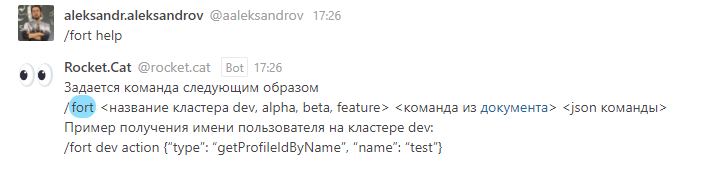

# HELP

**Назначение команды:** Команда возвращает скелет команд и ссылку на страницу конфлюенса с возможными командами.


Пример команды:

```
/fort help
```

Результатом запроса будет сообщение Rocket.Cat:




