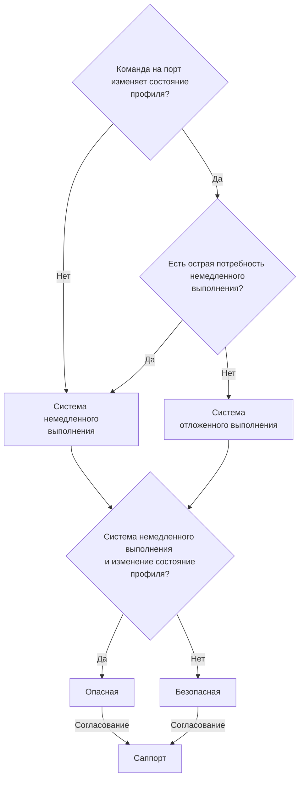
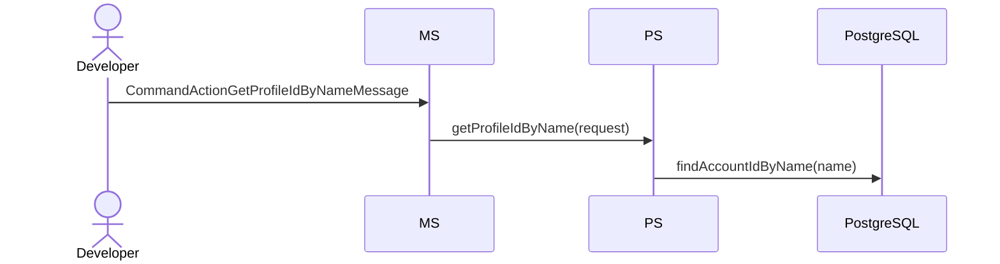
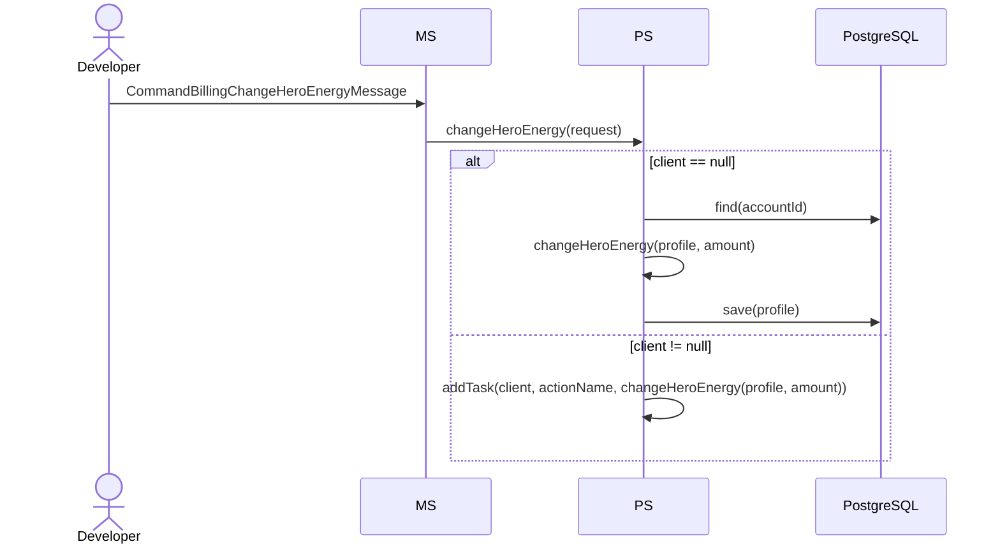
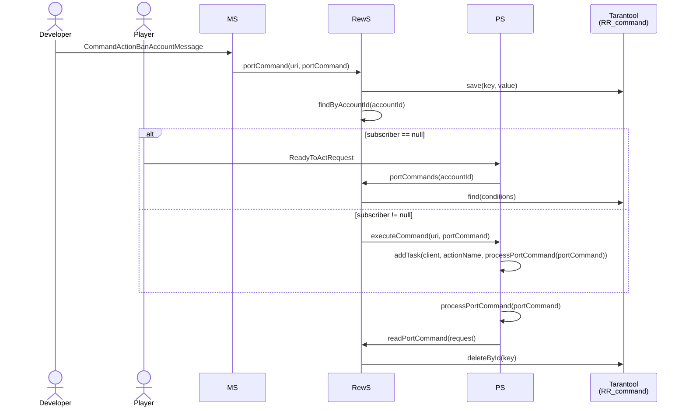

# Система выполнения команд на порт

### Что такое команда на порт?

Команда на порт - это специальное техническое сообщение, отправив которое,
можно повлиять на работу игры или получить какую-то информацию. 
Например: начислить ресурсы игроку, скачать реплей боя и.т.д.

На текущий момент в проекте присутствует две системы выполнения команд на порт:
1) Система немедленного выполнения: команды на порт выполняются немедленно, не зависимо от состояния игрока.
2) Система отложенного выполнения: команды на порт выполняются немедленно только в том случае, если игрок онлайн. 
В противном случае будут выполнены, когда игрок войдёт в игру.

При этом команды на порт изменяющие состояние профиля игрока подразделяются на следующие типы:
1) Опасные: изменение состояния профиля игрока может осуществляться путём персиста в БД (сохранения профиля игрока в БД PostgreSQL).
2) Безопасные: изменение состояния профиля игрока осуществляться только в потоке клиента.

### Список опасных и безопасных команд на порт

| №  | Опасные команды на порт                     | Безопасные команды на порт      |
|----|---------------------------------------------|---------------------------------|
| 1  | /ACTION/skipOneDayOfEntrance                | /ACTION/banAccount              |
| 2  | /ACTION/updateEntrance                      | /ACTION/setRole                 |
| 3  | /BILLING/takeAway                           | /ACTION/banUserInChat           |
| 4  | /DEBUG/initBattlePassAndQuestsAndOffers     | /ACTION/changeUserBanInfoInChat |
| 5  | /DEBUG/makeOffer                            | /DEBUG/restoreHeroesEnergy      |
| 6  | /DEBUG/swapProgress                         | /DEBUG/executeMission           |
| 7  | /DEBUG/setVisualRatingByDivision            | /BILLING/changeHeroEnergy       |
| 8  | /DEBUG/setVisualRatingByRating              |                                 |
| 9  | /DEBUG/setScrollXp                          |                                 |
| 10 | /DEBUG/setRemainingMinutesToScales          |                                 |
| 11 | /DEBUG/setRemainingMinutesToScalesByScaleId |                                 |
| 12 | /DEBUG/openAllEntityAndSetEquipments        |                                 |
| 13 | /DEBUG/openAllEntity                        |                                 |
| 14 | /DEBUG/setEquipments                        |                                 |
| 15 | /DEBUG/setScrolls                           |                                 |
| 16 | /DEBUG/deleteEquipments                     |                                 |
| 17 | /DEBUG/allUpgradeUnitsBuildingsScrolls      |                                 |
| 18 | /DEBUG/upgradeUnitBuildingScroll            |                                 |
| 19 | /DEBUG/updateOffersTime                     |                                 |
| 20 | /DEBUG/changeQuest                          |                                 |
| 21 | /DEBUG/completeQuest                        |                                 |
| 22 | /DEBUG/completeMainScreenQuest              |                                 |
| 23 | /DEBUG/setRemainingDaysToQuests             |                                 |
| 24 | /DEBUG/setProfileMmr                        |                                 |

Тип любой из указанной выше команды на порт может быть изменён в случае необходимости.

### Определение типа команды на порт и выбор системы выполнения

Перед реализацией новой команды на порт необходимо:
1) Выбрать систему выполнения.
2) Определить тип команды на порт.
3) Согласовать систему выполнения и тип команды на порт с саппортом.
4) Отредактировать таблицу опасных и безопасных команд на порт по результату выполнения работ.

**Важно!** Необходимо стремиться к тому, чтобы для всех команд на порт, изменяющих состояние профиля игрока,
использовалась система отложенного выполнения. Но при этом допускается возможность использования системы немедленного выполнения.

Схема для определения типа команды на порт и системы выполнения:

### Система немедленного выполнения команд на порт

Особенности системы немедленного выполнения:
1) Команда на порт не сохраняется во временное хранилище Tarantool'а, так как в любом случае будет выполнена немедленно.
2) Выполнение команды на порт, не изменяющей состояние профиля игрока, гарантирует получение ожидаемого результата.
3) Выполнение команды на порт, изменяющей состояние профиля игрока, гарантирует получение ожидаемого результата,
если игрок в момент выполнения команды на порт находился онлайн (объект `PlayerClient` был найден в контексте).
В таком случае команда на порт выполняется в потоке клиента.
4) Выполнение команды на порт, изменяющей состояние профиля игрока, не гарантирует получение ожидаемого результата,
если игрок в момент выполнения команды на порт находился офлайн (объект `PlayerClient` не был найден в контексте).
В таком случае команда на порт выполняется путём персиста в БД.

Схема немедленного выполнения команды на порт, не изменяющей состояние профиля игрока (на примере `/ACTION/getProfileIdByName`):

Схема немедленного выполнения команды на порт, изменяющей состояние профиля игрока (на примере `/BILLING/changeHeroEnergy`):

### Система отложенного выполнения команд на порт

Особенности системы отложенного выполнения:
1) Команда на порт сохраняется во временное хранилище Tarantool'а и удаляется после выполнения.
2) Команда по порт хранится в Tarantool'е на протяжении 30-и дней, после чего удаляется и не выполняется.
3) Выполнение команды на порт, изменяющей состояние профиля игрока, всегда гарантирует получение ожидаемого результата.
4) Если в момент выполнения команды на порт игрок онлайн (`subscriber != null`),
то команда на порт будет выполнена немедленно.
5) Если в момент выполнения команды на порт игрок офлайн (`subscriber == null`),
то команда на порт будет выполнена, когда игрок войдёт в игру (в момент получения на сервере `ReadyToActRequest`).

Схема отложенного выполнения команды на порт, изменяющей состояние профиля игрока (на примере `/ACTION/banAccount`):

# Как отправлять команды на порт

### Где отправлять команды на порт?

Отправка команд на порт осуществляется только в рамках канала [#fort-develop](https://mattermost.gearwap.ru/geargames/channels/fort-develop).

Для разных типов команд есть свой тред (они закреплены в канале).

ВАЖНО: Команды на порт можно отправлять
и вне тредов, но не рекомендуется это делать, чтобы не засорять канал.

### Права на отправку команд
Права на отправку команд на порт можно запросить у лидов.

### Как посмотреть свой AccountId (на девелоперском лейбле)
Cвой AccountId (на девелоперском лейбле) можно увидеть в редакторе
юнити в игре

### Команды

Базовый функционал команд, предоставляется в рамках установленных директив. Создание команд не требует высокой вовлеченности в разработку.

Использование любой команды без параметров выводит ссылку на документацию о команде из списка ниже.

{{EXT-AOWX/@self}}

  
Список команд

    
 

    

