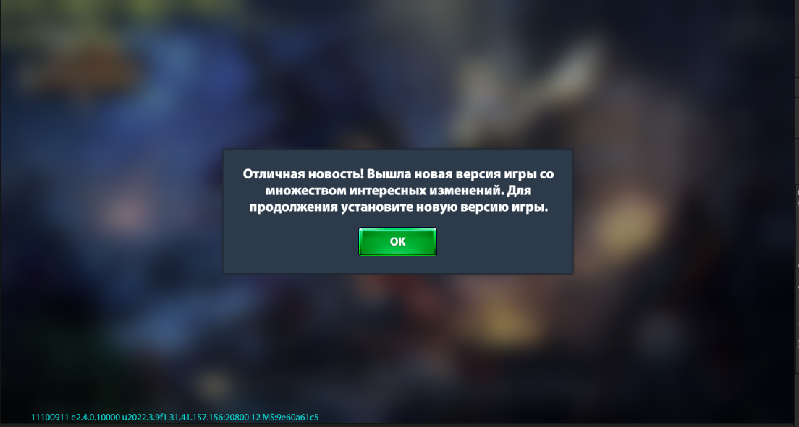
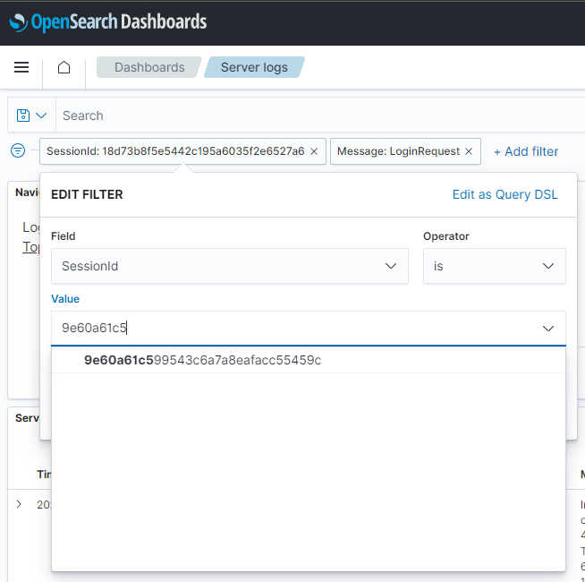
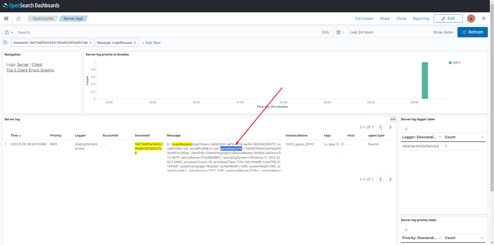
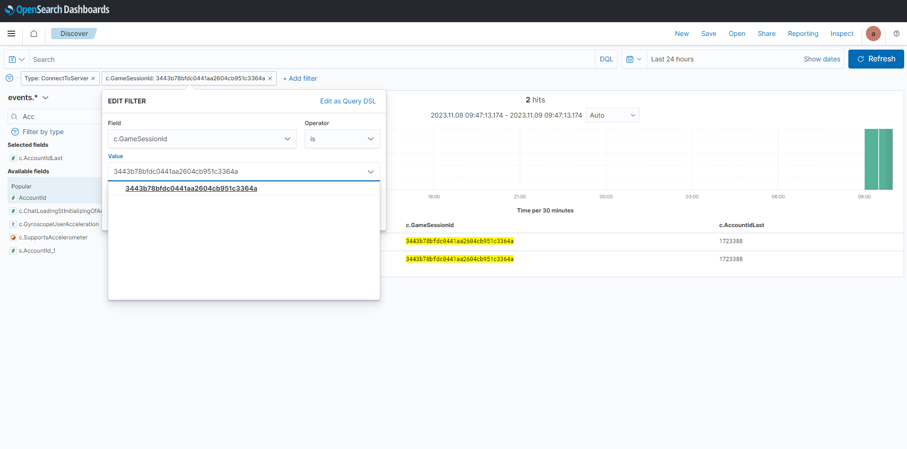

# Перенос прогресса

**Назначение команды:** Перенос прогресса с одного аккаунта на другой

Пример команды:
```
/fort develop DEBUG {“type”: “swapProgress”, “accountId”:1760185, “newAccountId”:1760413}
```
Поле `accountId` - поле для указания идентификатора аккаунта, ИЗ КОТОРОГО будет перенесён прогресс

Поле `newAccountId` - поле для указания идентификатора аккаунта, В КОТОРЫЙ будет перенесён прогресс

**Результат выполнения команды на порт:**

На новом аккаунте, в который переносился прогресс отобразиться сообщение о том что аккаунт был забанен,
после этого произойдёт релогин и произойдёт вход в старый аккаунт с прогрессом

<details>
<summary>Как получить идентификатор аккаунта игрока, который зашёл с забаненной сборки</summary>

1. Получить от игрока скриншот с проблемой о низкой версии (На скриншоте должен быть идентификатор сессии)
Пример такого скриншота:

2. Перейти на серверный дашборд: [OpenSearch](https://fort-elkdev.gearwap.ru/goto/ccbd4fab44b8e42f453530643684a998?security_tenant=global)
3. В выбранном фильтре по полю `SessionId` ввести значение сессии игрока

4. В полученном логе `LoginRequest` найти поле `gameSessionId`

5. Перейти в раздел Discover: [OpenSearch](https://fort-elkdev.gearwap.ru/goto/ccbd4fab44b8e42f453530643684a998?security_tenant=global)
6. В выбранном фильтре по поле `gameSessionId` указать полученное значение из лога запроса `LoginRequest` (Шаг №4)

7. Использовать значение в поле `c.AccountIdLast` в команде на порт
</details>